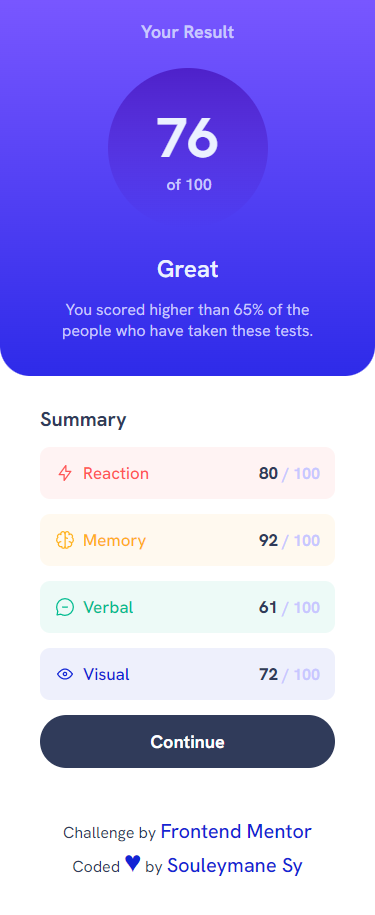
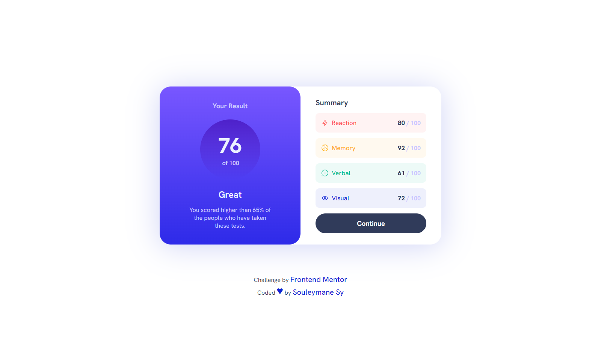

# Frontend Mentor - Results summary component

## Welcome! 👋

Thanks for checking out this front-end coding challenge.

This is a solution to the [Results summary component challenge on Frontend Mentor](https://www.frontendmentor.io/challenges/results-summary-component-CE_K6s0maV).

[Frontend Mentor](https://www.frontendmentor.io) challenges help you improve your coding skills by building realistic projects.

- [The challenge](#the-challenge)
- [Screenshot](#screenshot)
- [Built with](#built-with)
- [Author](#author)

## The challenge

The challenge is to build out this results summary component and get it looking as close to the design as possible.

Your users should be able to:

- View the optimal layout for the interface depending on their device's screen size
- See hover and focus states for all interactive elements on the page

### Screenshot

This is the Screenshot of the projects a made!

### Mobile Screenshot

### Desktops Screenshot

### Links

- Solution URL: [solution URL here](https://www.frontendmentor.io/solutions/results-summary-components-responsive-html-and-sass-RXf8BEkCCs)
- Live Site URL: [live site URL here](https://fem-results-summary-component-livid.vercel.app/)

## My process

Made this projects with HTML5 and SASS !!!

### Built with

- Semantic HTML5 markup
- SASS
- CSS custom properties
- Flexbox
- CSS Grid
- Mobile-first workflow
- npm

## Author

- GitHub - [Souleymane Sy](https://github.com/SouleymaneSy7)
- Frontend Mentor - [@SouleymaneSy7](https://www.frontendmentor.io/profile/SouleymaneSy7)
- Twitter - [@Souleymanesy43](https://twitter.com/Souleymanesy43)
